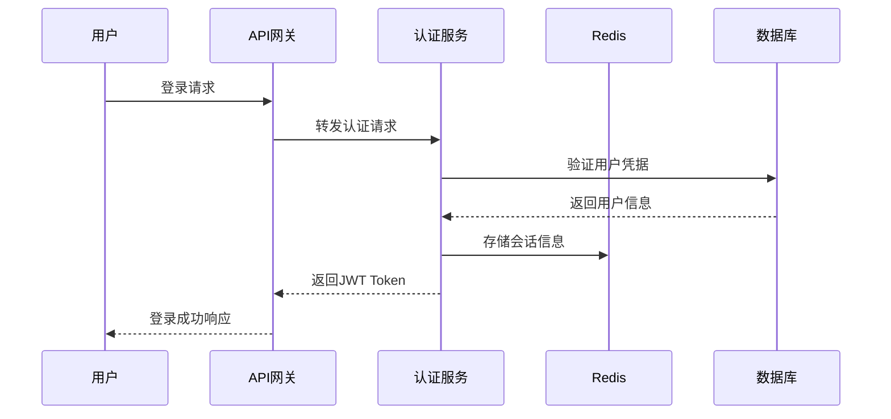
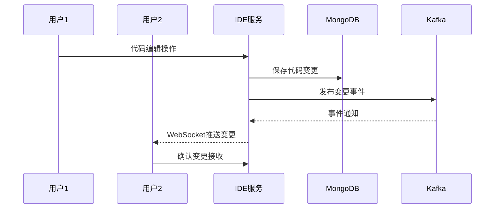
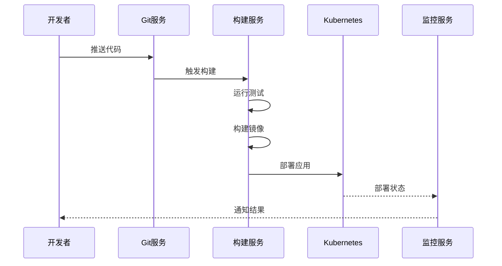

# CloudDev Platform 软件架构设计文档

## 1. 架构概述

### 1.1 系统架构设计原则
- **微服务架构**: 采用领域驱动设计，按业务领域拆分服务
- **云原生**: 基于容器化和Kubernetes的云原生架构
- **高可用**: 无单点故障，支持容灾和故障自愈
- **高性能**: 异步处理、缓存优化、负载均衡
- **安全第一**: 零信任安全模型，多层安全防护

### 1.2 整体架构图

```
┌─────────────────────────────────────────────────────────────────┐
│                          用户层                                   │
├─────────────────────────────────────────────────────────────────┤
│  Web IDE界面  │  项目管理界面  │  移动端App  │  CLI工具  │  VS Code插件  │
└─────────────────────────────────────────────────────────────────┘
                                    │
┌─────────────────────────────────────────────────────────────────┐
│                        接入层                                     │
├─────────────────────────────────────────────────────────────────┤
│           CDN            │         负载均衡器         │    API网关     │
└─────────────────────────────────────────────────────────────────┘
                                    │
┌─────────────────────────────────────────────────────────────────┐
│                        应用层                                     │
├─────────────────────────────────────────────────────────────────┤
│ 认证服务 │ IDE服务 │ Git服务 │ 构建服务 │ 项目服务 │ 协作服务 │ 监控服务 │
└─────────────────────────────────────────────────────────────────┘
                                    │
┌─────────────────────────────────────────────────────────────────┐
│                        数据层                                     │
├─────────────────────────────────────────────────────────────────┤
│  PostgreSQL  │   Redis   │  MongoDB  │   MinIO   │   Kafka      │
└─────────────────────────────────────────────────────────────────┘
                                    │
┌─────────────────────────────────────────────────────────────────┐
│                      基础设施层                                   │
├─────────────────────────────────────────────────────────────────┤
│              Kubernetes集群 + Docker容器运行时                    │
│                     多云基础设施                                   │
└─────────────────────────────────────────────────────────────────┘
```

## 2. 系统分层架构

### 2.1 用户接入层 (Presentation Layer)

#### 2.1.1 Web前端应用
```typescript
// 技术栈
- React 18 + TypeScript
- Ant Design UI组件库  
- Redux Toolkit状态管理
- Monaco Editor代码编辑器
- Socket.IO实时通信
- Webpack 5模块打包

// 主要组件
├── src/
│   ├── components/          # 通用组件
│   │   ├── Editor/         # 代码编辑器组件
│   │   ├── FileTree/       # 文件树组件
│   │   ├── Terminal/       # 终端组件
│   │   └── Collaboration/  # 协作组件
│   ├── pages/              # 页面组件
│   │   ├── IDE/           # IDE页面
│   │   ├── Projects/      # 项目管理页面
│   │   ├── Dashboard/     # 仪表盘页面
│   │   └── Settings/      # 设置页面
│   ├── services/          # API服务
│   ├── store/             # 状态管理
│   ├── hooks/             # 自定义Hook
│   └── utils/             # 工具函数
```

#### 2.1.2 移动端应用
```javascript
// React Native跨平台移动应用
- 支持iOS和Android
- 轻量级IDE功能
- 项目状态查看
- 团队协作和通知
```

### 2.2 网关接入层 (Gateway Layer)

#### 2.2.1 API网关
```yaml
# Spring Cloud Gateway配置
apiVersion: v1
kind: Service
metadata:
  name: api-gateway
spec:
  routes:
    - id: auth-route
      uri: lb://auth-service
      predicates:
        - Path=/api/auth/**
    - id: ide-route  
      uri: lb://ide-service
      predicates:
        - Path=/api/ide/**
  filters:
    - name: AuthenticationFilter
    - name: RateLimitFilter
    - name: CorsFilter
```

#### 2.2.2 负载均衡
```yaml
# Nginx配置
upstream backend {
    server gateway-1:8080 weight=3;
    server gateway-2:8080 weight=3;
    server gateway-3:8080 weight=2;
    keepalive 32;
}

server {
    listen 80;
    location /api/ {
        proxy_pass http://backend;
        proxy_http_version 1.1;
        proxy_set_header Connection "";
    }
}
```

### 2.3 应用服务层 (Application Layer)

#### 2.3.1 认证授权服务 (Auth Service)
```java
@RestController
@RequestMapping("/api/auth")
public class AuthController {
    
    @Autowired
    private AuthService authService;
    
    @PostMapping("/login")
    public ResponseEntity<LoginResponse> login(@RequestBody LoginRequest request) {
        // JWT Token生成
        // 多因素认证支持
        // SSO集成
    }
    
    @PostMapping("/oauth")
    public ResponseEntity<OAuthResponse> oauth(@RequestBody OAuthRequest request) {
        // OAuth2.0集成
        // 第三方登录支持
    }
}

// 权限管理
@Entity
public class Permission {
    private String resource;      // 资源
    private String action;        // 操作
    private String condition;     // 条件
}

@Entity  
public class Role {
    private String name;
    @ManyToMany
    private Set<Permission> permissions;
}
```

#### 2.3.2 IDE核心服务 (IDE Service)
```java
@RestController
@RequestMapping("/api/ide")
public class IDEController {
    
    @GetMapping("/workspace/{workspaceId}")
    public WorkspaceInfo getWorkspace(@PathVariable String workspaceId) {
        // 获取工作空间信息
    }
    
    @PostMapping("/workspace")
    public WorkspaceInfo createWorkspace(@RequestBody CreateWorkspaceRequest request) {
        // 创建新的工作空间
        // 容器化环境初始化
    }
    
    @WebSocketEndpoint("/ws/collaboration/{workspaceId}")
    public class CollaborationEndpoint {
        // 实时协作WebSocket处理
        // 操作同步和冲突解决
    }
}

// 代码编辑器核心
@Service
public class EditorService {
    public void handleCodeChange(CodeChangeEvent event) {
        // 代码变更处理
        // 语法分析和智能补全
        // 实时协作同步
    }
}
```

#### 2.3.3 Git版本控制服务 (Git Service)
```java
@RestController
@RequestMapping("/api/git")
public class GitController {
    
    @PostMapping("/repository")
    public RepositoryInfo createRepository(@RequestBody CreateRepoRequest request) {
        // Git仓库创建
    }
    
    @PostMapping("/commit")
    public CommitResult commit(@RequestBody CommitRequest request) {
        // 代码提交
        // 分支管理
    }
    
    @PostMapping("/merge")
    public MergeResult merge(@RequestBody MergeRequest request) {
        // 分支合并
        // 冲突解决
    }
}

// Git操作封装
@Service
public class GitOperationService {
    public void handleGitOperation(GitOperation operation) {
        // JGit库集成
        // Git命令执行
        // 版本历史管理
    }
}
```

#### 2.3.4 CI/CD构建服务 (Build Service)
```java
@RestController
@RequestMapping("/api/build")
public class BuildController {
    
    @PostMapping("/pipeline")
    public PipelineResult createPipeline(@RequestBody PipelineConfig config) {
        // 构建流水线创建
    }
    
    @PostMapping("/execute/{pipelineId}")
    public ExecutionResult execute(@PathVariable String pipelineId) {
        // 流水线执行
    }
}

// 构建引擎
@Service
public class BuildEngine {
    public void executeBuild(BuildJob job) {
        // Docker容器构建
        // 测试执行
        // 部署流程
    }
}
```

#### 2.3.5 项目管理服务 (Project Service)
```java
@RestController
@RequestMapping("/api/projects")
public class ProjectController {
    
    @GetMapping
    public List<Project> getProjects() {
        // 项目列表获取
    }
    
    @PostMapping
    public Project createProject(@RequestBody CreateProjectRequest request) {
        // 项目创建
    }
    
    @PostMapping("/tasks")
    public Task createTask(@RequestBody CreateTaskRequest request) {
        // 任务创建和管理
    }
}

// 敏捷管理
@Entity
public class Sprint {
    private String name;
    private LocalDate startDate;
    private LocalDate endDate;
    @OneToMany
    private List<Task> tasks;
}
```

### 2.4 数据持久层 (Data Layer)

#### 2.4.1 关系型数据库 (PostgreSQL)
```sql
-- 用户表
CREATE TABLE users (
    id UUID PRIMARY KEY DEFAULT gen_random_uuid(),
    username VARCHAR(50) UNIQUE NOT NULL,
    email VARCHAR(100) UNIQUE NOT NULL,
    password_hash VARCHAR(255) NOT NULL,
    created_at TIMESTAMP DEFAULT CURRENT_TIMESTAMP,
    updated_at TIMESTAMP DEFAULT CURRENT_TIMESTAMP
);

-- 项目表
CREATE TABLE projects (
    id UUID PRIMARY KEY DEFAULT gen_random_uuid(),
    name VARCHAR(100) NOT NULL,
    description TEXT,
    owner_id UUID REFERENCES users(id),
    repository_url VARCHAR(255),
    created_at TIMESTAMP DEFAULT CURRENT_TIMESTAMP
);

-- 工作空间表
CREATE TABLE workspaces (
    id UUID PRIMARY KEY DEFAULT gen_random_uuid(),
    project_id UUID REFERENCES projects(id),
    name VARCHAR(100) NOT NULL,
    environment_config JSONB,
    status VARCHAR(20) DEFAULT 'active',
    created_at TIMESTAMP DEFAULT CURRENT_TIMESTAMP
);
```

#### 2.4.2 缓存层 (Redis)
```yaml
# Redis配置
redis:
  cluster:
    nodes:
      - redis-node-1:6379
      - redis-node-2:6379  
      - redis-node-3:6379
  timeout: 5000
  max-active: 100
  
# 缓存策略
session-cache:
  expire: 86400  # 24小时
code-cache:
  expire: 3600   # 1小时
user-cache:
  expire: 1800   # 30分钟
```

#### 2.4.3 文档数据库 (MongoDB)
```javascript
// 代码文件集合
db.code_files.createIndex({ "workspace_id": 1, "path": 1 });
db.code_files.createIndex({ "updated_at": -1 });

// 协作历史集合
db.collaboration_history.createIndex({ "workspace_id": 1, "timestamp": -1 });
db.collaboration_history.createIndex({ "user_id": 1, "timestamp": -1 });

// 构建日志集合
db.build_logs.createIndex({ "build_id": 1, "timestamp": -1 });
db.build_logs.createIndex({ "project_id": 1, "timestamp": -1 });
```

### 2.5 基础设施层 (Infrastructure Layer)

#### 2.5.1 容器编排 (Kubernetes)
```yaml
# Deployment配置
apiVersion: apps/v1
kind: Deployment
metadata:
  name: ide-service
spec:
  replicas: 3
  selector:
    matchLabels:
      app: ide-service
  template:
    metadata:
      labels:
        app: ide-service
    spec:
      containers:
      - name: ide-service
        image: clouddev/ide-service:latest
        ports:
        - containerPort: 8080
        env:
        - name: DATABASE_URL
          valueFrom:
            secretKeyRef:
              name: db-secret
              key: url
        resources:
          requests:
            memory: "256Mi"
            cpu: "250m"
          limits:
            memory: "512Mi"
            cpu: "500m"
```

#### 2.5.2 服务网格 (Istio)
```yaml
# 虚拟服务配置
apiVersion: networking.istio.io/v1alpha3
kind: VirtualService
metadata:
  name: ide-service
spec:
  http:
  - match:
    - uri:
        prefix: /api/ide
  route:
  - destination:
      host: ide-service
    weight: 100
  fault:
    delay:
      percentage:
        value: 0.1
      fixedDelay: 5s
```

## 3. 核心业务流程

### 3.1 用户认证流程


### 3.2 代码协作编辑流程


### 3.3 CI/CD流水线流程


## 4. 数据架构设计

### 4.1 数据模型设计

#### 4.1.1 用户域模型
```java
@Entity
@Table(name = "users")
public class User {
    @Id
    private UUID id;
    
    @Column(unique = true, nullable = false)
    private String username;
    
    @Column(unique = true, nullable = false)
    private String email;
    
    @Column(nullable = false)
    private String passwordHash;
    
    @OneToMany(mappedBy = "owner")
    private Set<Project> ownedProjects;
    
    @ManyToMany
    @JoinTable(name = "user_projects")
    private Set<Project> projects;
    
    @CreationTimestamp
    private LocalDateTime createdAt;
    
    @UpdateTimestamp
    private LocalDateTime updatedAt;
}
```

#### 4.1.2 项目域模型
```java
@Entity
@Table(name = "projects")
public class Project {
    @Id
    private UUID id;
    
    @Column(nullable = false)
    private String name;
    
    private String description;
    
    @ManyToOne
    @JoinColumn(name = "owner_id")
    private User owner;
    
    @Column(name = "repository_url")
    private String repositoryUrl;
    
    @OneToMany(mappedBy = "project")
    private Set<Workspace> workspaces;
    
    @Enumerated(EnumType.STRING)
    private ProjectStatus status;
    
    @CreationTimestamp
    private LocalDateTime createdAt;
}
```

#### 4.1.3 工作空间域模型
```java
@Entity
@Table(name = "workspaces")
public class Workspace {
    @Id
    private UUID id;
    
    @ManyToOne
    @JoinColumn(name = "project_id")
    private Project project;
    
    @Column(nullable = false)
    private String name;
    
    @Type(type = "jsonb")
    @Column(name = "environment_config")
    private EnvironmentConfig environmentConfig;
    
    @Enumerated(EnumType.STRING)
    private WorkspaceStatus status;
    
    @CreationTimestamp
    private LocalDateTime createdAt;
}
```

### 4.2 数据分布策略

#### 4.2.1 读写分离
```yaml
# 主从数据库配置
datasource:
  master:
    url: jdbc:postgresql://master-db:5432/clouddev
    username: ${DB_USERNAME}
    password: ${DB_PASSWORD}
  slave:
    url: jdbc:postgresql://slave-db:5432/clouddev
    username: ${DB_USERNAME}
    password: ${DB_PASSWORD}
```

#### 4.2.2 分库分表
```java
@ShardingTable(actualDataNodes = "ds$->{0..1}.workspace_$->{0..15}")
@TableShards({
    @TableShard(shardingColumn = "project_id", algorithmExpression = "workspace_${project_id.hashCode() % 16}")
})
public class Workspace {
    // 按项目ID进行分表
}
```

## 5. 安全架构设计

### 5.1 认证机制
```java
@Configuration
@EnableWebSecurity
public class SecurityConfig {
    
    @Bean
    public JwtAuthenticationFilter jwtAuthenticationFilter() {
        return new JwtAuthenticationFilter();
    }
    
    @Bean
    public OAuth2LoginSuccessHandler oauth2LoginSuccessHandler() {
        return new OAuth2LoginSuccessHandler();
    }
    
    @Override
    protected void configure(HttpSecurity http) throws Exception {
        http
            .authorizeRequests()
            .antMatchers("/api/auth/**").permitAll()
            .anyRequest().authenticated()
            .and()
            .oauth2Login()
            .successHandler(oauth2LoginSuccessHandler())
            .and()
            .addFilterBefore(jwtAuthenticationFilter(), UsernamePasswordAuthenticationFilter.class);
    }
}
```

### 5.2 权限控制
```java
@PreAuthorize("hasPermission(#projectId, 'PROJECT', 'READ')")
public Project getProject(@PathVariable String projectId) {
    return projectService.findById(projectId);
}

@PreAuthorize("hasPermission(#workspaceId, 'WORKSPACE', 'WRITE')")
public void updateWorkspace(@PathVariable String workspaceId, @RequestBody UpdateWorkspaceRequest request) {
    workspaceService.update(workspaceId, request);
}
```

### 5.3 数据加密
```java
@Configuration
public class EncryptionConfig {
    
    @Bean
    public AESUtil aesUtil() {
        return new AESUtil("your-secret-key");
    }
    
    @EventListener
    public void handleUserCreate(UserCreateEvent event) {
        // 敏感数据加密存储
        event.getUser().setEmail(aesUtil.encrypt(event.getUser().getEmail()));
    }
}
```

## 6. 性能优化设计

### 6.1 缓存策略
```java
@Service
public class UserService {
    
    @Cacheable(value = "users", key = "#userId")
    public User findById(String userId) {
        return userRepository.findById(userId);
    }
    
    @CacheEvict(value = "users", key = "#user.id")
    public User updateUser(User user) {
        return userRepository.save(user);
    }
}
```

### 6.2 异步处理
```java
@Service
public class BuildService {
    
    @Async("buildExecutor")
    public CompletableFuture<BuildResult> executeBuild(BuildJob job) {
        // 异步执行构建任务
        BuildResult result = doBuild(job);
        return CompletableFuture.completedFuture(result);
    }
}

@Configuration
@EnableAsync
public class AsyncConfig {
    
    @Bean("buildExecutor")
    public TaskExecutor buildExecutor() {
        ThreadPoolTaskExecutor executor = new ThreadPoolTaskExecutor();
        executor.setCorePoolSize(10);
        executor.setMaxPoolSize(50);
        executor.setQueueCapacity(100);
        executor.setThreadNamePrefix("build-");
        return executor;
    }
}
```

### 6.3 数据库优化
```sql
-- 索引优化
CREATE INDEX CONCURRENTLY idx_workspaces_project_id ON workspaces(project_id);
CREATE INDEX CONCURRENTLY idx_workspaces_status_created ON workspaces(status, created_at DESC);
CREATE INDEX CONCURRENTLY idx_users_email_hash ON users USING hash(email);

-- 分区表
CREATE TABLE collaboration_history (
    id UUID PRIMARY KEY,
    workspace_id UUID NOT NULL,
    user_id UUID NOT NULL,
    operation_type VARCHAR(50) NOT NULL,
    operation_data JSONB,
    timestamp TIMESTAMP NOT NULL
) PARTITION BY RANGE (timestamp);

CREATE TABLE collaboration_history_2024 PARTITION OF collaboration_history
    FOR VALUES FROM ('2024-01-01') TO ('2025-01-01');
```

## 7. 监控和可观测性

### 7.1 应用监控
```java
@RestController
public class MetricsController {
    
    private final MeterRegistry meterRegistry;
    
    @GetMapping("/api/projects")
    @Timed(name = "projects.list", description = "List projects")
    public List<Project> listProjects() {
        Counter.builder("projects.list.count")
            .tag("user", getCurrentUser())
            .register(meterRegistry)
            .increment();
        
        return projectService.listProjects();
    }
}
```

### 7.2 日志聚合
```yaml
# Logback配置
logging:
  pattern:
    console: "%d{yyyy-MM-dd HH:mm:ss} [%thread] %-5level [%logger{36}] - %msg%n"
  level:
    com.clouddev: DEBUG
    org.springframework: INFO
    
# ELK Stack集成
appender:
  logstash:
    destination: logstash-server:5044
    encoder:
      pattern: '{"timestamp":"%d","level":"%level","logger":"%logger","message":"%message"}'
```

### 7.3 分布式链路追踪
```java
@RestController
public class IDEController {
    
    @Autowired
    private Tracer tracer;
    
    @GetMapping("/workspace/{id}")
    public WorkspaceInfo getWorkspace(@PathVariable String id) {
        Span span = tracer.nextSpan()
            .name("get-workspace")
            .tag("workspace.id", id)
            .start();
        
        try (Tracer.SpanInScope ws = tracer.withSpanInScope(span)) {
            return workspaceService.findById(id);
        } finally {
            span.end();
        }
    }
}
```

## 8. 容灾和高可用

### 8.1 多地域部署
```yaml
# 主地域部署
apiVersion: apps/v1
kind: Deployment
metadata:
  name: ide-service-primary
  labels:
    region: primary
spec:
  replicas: 5
  template:
    spec:
      affinity:
        nodeAffinity:
          requiredDuringSchedulingIgnoredDuringExecution:
            nodeSelectorTerms:
            - matchExpressions:
              - key: region
                operator: In
                values: ["us-east-1"]

# 灾备地域部署
apiVersion: apps/v1
kind: Deployment
metadata:
  name: ide-service-backup
  labels:
    region: backup
spec:
  replicas: 2
  template:
    spec:
      affinity:
        nodeAffinity:
          requiredDuringSchedulingIgnoredDuringExecution:
            nodeSelectorTerms:
            - matchExpressions:
              - key: region
                operator: In
                values: ["us-west-2"]
```

### 8.2 数据备份策略
```bash
#!/bin/bash
# 数据库备份脚本
BACKUP_DIR="/backup/postgresql"
TIMESTAMP=$(date +%Y%m%d_%H%M%S)

# 创建备份
pg_dump -h $DB_HOST -U $DB_USER -d clouddev > $BACKUP_DIR/clouddev_$TIMESTAMP.sql

# 上传到对象存储
aws s3 cp $BACKUP_DIR/clouddev_$TIMESTAMP.sql s3://clouddev-backup/database/

# 清理本地备份文件(保留7天)
find $BACKUP_DIR -name "*.sql" -mtime +7 -delete
```

### 8.3 故障自愈
```yaml
# 健康检查配置
apiVersion: v1
kind: Pod
spec:
  containers:
  - name: ide-service
    livenessProbe:
      httpGet:
        path: /actuator/health
        port: 8080
      initialDelaySeconds: 30
      periodSeconds: 10
      failureThreshold: 3
    readinessProbe:
      httpGet:
        path: /actuator/health/readiness
        port: 8080
      initialDelaySeconds: 5
      periodSeconds: 5
      
# HPA自动扩缩容
apiVersion: autoscaling/v2
kind: HorizontalPodAutoscaler
metadata:
  name: ide-service-hpa
spec:
  scaleTargetRef:
    apiVersion: apps/v1
    kind: Deployment
    name: ide-service
  minReplicas: 3
  maxReplicas: 50
  metrics:
  - type: Resource
    resource:
      name: cpu
      target:
        type: Utilization
        averageUtilization: 70
  - type: Resource
    resource:
      name: memory
      target:
        type: Utilization
        averageUtilization: 80
```

## 9. 部署架构

### 9.1 环境规划
```yaml
# 开发环境
development:
  replicas: 1
  resources:
    cpu: 100m
    memory: 256Mi
  database:
    size: small
    replicas: 1

# 测试环境  
testing:
  replicas: 2
  resources:
    cpu: 200m
    memory: 512Mi
  database:
    size: medium
    replicas: 2

# 生产环境
production:
  replicas: 5
  resources:
    cpu: 500m
    memory: 1Gi
  database:
    size: large
    replicas: 3
```

### 9.2 CI/CD流水线
```yaml
# GitLab CI配置
stages:
  - test
  - build
  - deploy

test:
  stage: test
  script:
    - ./mvnw test
    - npm test
  coverage: '/Total.*?([0-9]{1,3}\.[0-9]{2})%/'

build:
  stage: build
  script:
    - docker build -t $CI_REGISTRY_IMAGE:$CI_COMMIT_SHA .
    - docker push $CI_REGISTRY_IMAGE:$CI_COMMIT_SHA
  only:
    - main
    - develop

deploy:
  stage: deploy
  script:
    - helm upgrade --install clouddev-platform ./helm-chart
    - kubectl set image deployment/ide-service ide-service=$CI_REGISTRY_IMAGE:$CI_COMMIT_SHA
  only:
    - main
```

## 10. 架构演进规划

### 10.1 技术债务管理
- 定期代码重构和优化
- 技术栈升级和迁移
- 架构模式演进
- 性能瓶颈识别和解决

### 10.2 扩展性规划
- 水平扩展能力增强
- 多租户架构升级
- 边缘计算集成
- AI/ML能力集成

### 10.3 未来技术趋势
- Serverless架构探索
- WebAssembly集成
- 量子计算准备
- 区块链技术应用

---

本架构设计文档将作为CloudDev Platform开发和运维的重要参考，随着项目的发展将持续更新和完善。